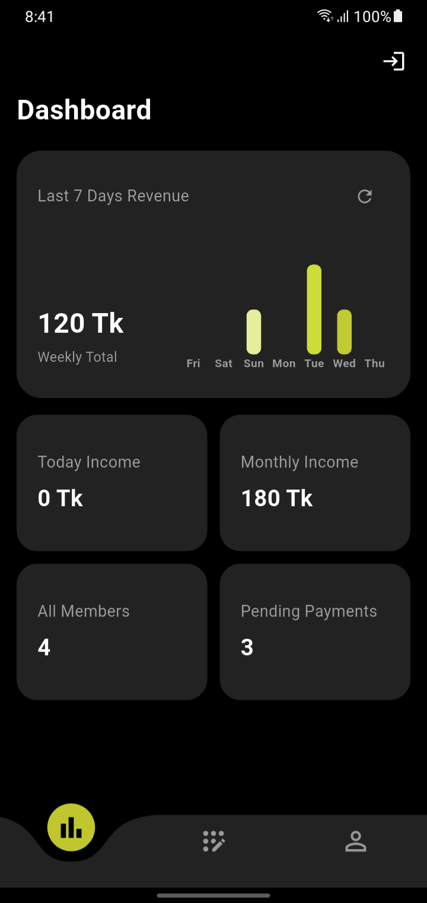
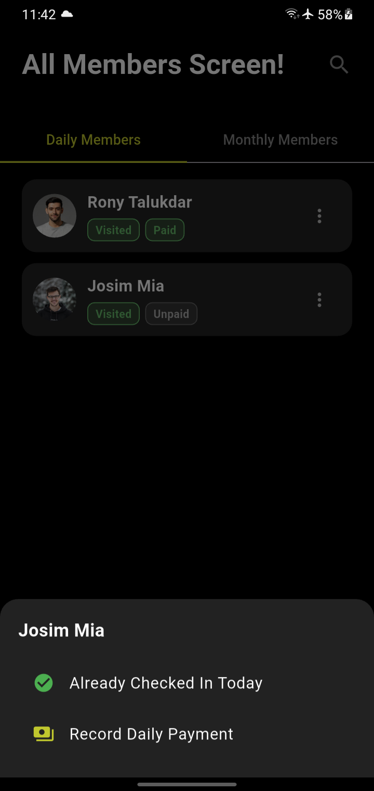
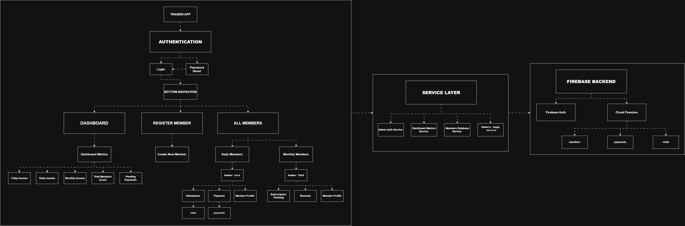

# Gym Management System — Case Study & Project Showcase

> **Note:** The underlying codebase for this software is private and proprietary. This repository serves as a technical case study, feature demonstration, and architectural overview.

---

## 📌 Project Overview
A comprehensive, full-stack gym management platform designed to streamline member check-ins, automated subscription billing, class scheduling, and administrative reporting.

Project Name | Trainer – End-to-End Gym Operations & Member App

- **Role:** Lead Developer (Full-Stack / Architecture / UI/UX)

- Responsibilities: Architected the end-to-end system to handle concurrent member check-ins, real-time database sync, and high-availability operations in active production. Designed custom workflows for gym staff and active members.
  
- **Target Audience:** Gym owners, front-desk staff, and active members.
  
- **Status:** In Active Production / Deployed

## Problem
The gym was experiencing three main challenges in managing its members and payments:

1. **Daily payment tracking and payment disputes**

Daily members were charged a fixed ৳30 for each visit. However, payments were recorded manually in a diary, making it difficult to reliably verify whether a member had actually paid.
This led to frequent payment disputes. A member could claim that they had already paid, while the manager had no written record of the transaction. Without a reliable payment history, it was difficult for the gym owner to verify the claim and prevent missed or disputed payments.

2. **Monthly subscription management**

Keeping track of monthly members, subscription end dates, and upcoming renewals was becoming difficult. The owner needed a clearer way to identify which memberships were active, expiring, or required renewal.

3. **Paper-based management**

Relying on regular paperwork for member records, visits, and payment tracking made everyday gym management slower and harder to maintain.

## 📸 Screenshots & Demos
| Dashboard Overview | Member Check-In Flow |
|  |  |

## 🛠️ Tech Stack & System Architecture

### Frontend
- **Framework:** [Flutter]
- **State Management:** [setState]
- **Styling/UI:** [Custom UI components, fl_chart]

### Backend & Infrastructure
- **Language/Runtime:** [Dart]
- **Database:** [Firebase Firestore]
- **Authentication:** [Firebase Auth]

### System Architecture Diagram

