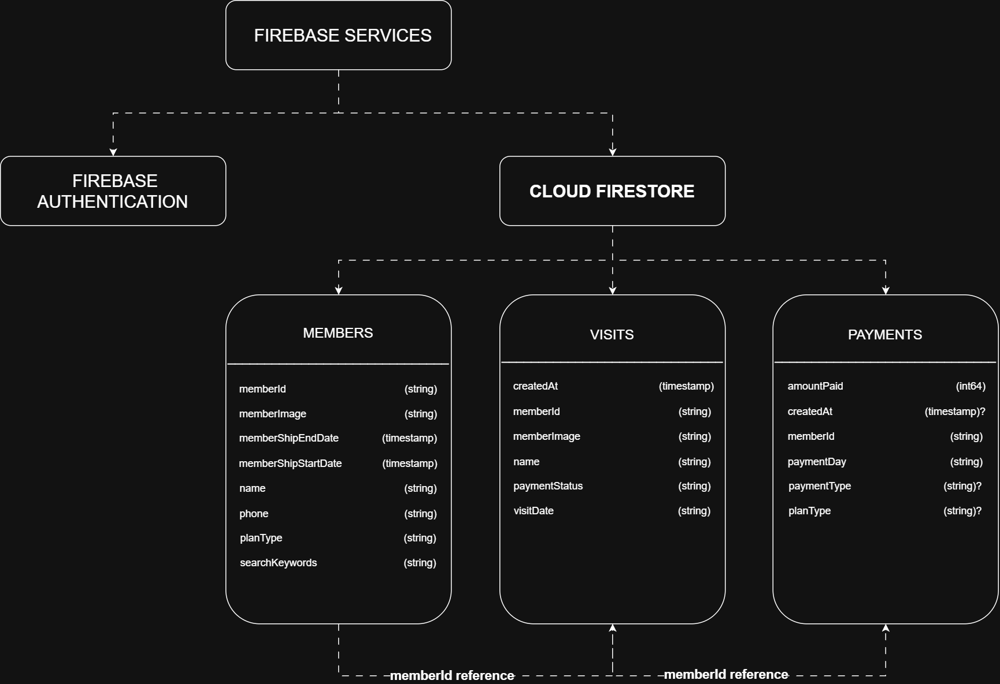
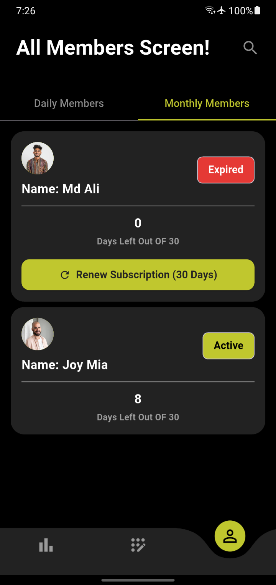

# Gym Management System — Case Study & Project Showcase

> **Note:** The underlying codebase for this software is private and proprietary. This repository serves as a technical case study, feature demonstration, and architectural overview.

## 📌 Project Overview
A comprehensive, full-stack gym management platform designed to streamline member check-ins, automated subscription billing, class scheduling, and administrative reporting.

Project Name | Trainer – End-to-End Gym Operations & Member App

- **Role:** Lead Developer (Full-Stack / Architecture / UI/UX)

- Responsibilities: Architected the end-to-end system to handle concurrent member check-ins, real-time database sync, and high-availability operations in active production. Designed custom workflows for gym staff and active members.
  
- **Target Audience:** Gym owners, front-desk staff, and active members.
  
- **Status:** In Active Production / Deployed

## Problem
The gym was experiencing three main challenges in managing its members and payments:

1. **Daily payment tracking and payment disputes**

Daily members were charged a fixed ৳30 for each visit. However, payments were recorded manually in a diary, making it difficult to reliably verify whether a member had actually paid.
This led to frequent payment disputes. A member could claim that they had already paid, while the manager had no written record of the transaction. Without a reliable payment history, it was difficult for the gym owner to verify the claim and prevent missed or disputed payments.

2. **Monthly subscription management**

Keeping track of monthly members, subscription end dates, and upcoming renewals was becoming difficult. The owner needed a clearer way to identify which memberships were active, expiring, or required renewal.

3. **Paper-based management**

Relying on regular paperwork for member records, visits, and payment tracking made everyday gym management slower and harder to maintain.

## Solution
The Trainer App replaces the gym's paper-based member and payment management with a centralized digital system.

1. **Reliable tracking system to prevent profit leakage**

When members attend the gym, their visit and payment status are digitally tracked. the gym manager/admin uses the simple visit button to record their visit and quickly classifies them as unpaid members. When they clear daily payments, the manager/admin taps the payment button, removing the members from the unpaid section. This provides the manager with a complete payment history for each member, avoids disagreements caused by missing or confusing diary records, and essentially eliminates gym earnings leakage.

2. **Simplified monthly subscription management**
   
Monthly members can be registered with their subscription period and tracked through the app. The manager can view membership status, monitor subscription end dates, and manage renewals without relying on manual records.

3. **Centralized member management**
   
Member records, visits, payments, and subscription information are stored in one system using Flutter and Firebase. The dashboard provides an overview of important gym metrics, helping the manager manage daily operations more efficiently while eliminating the daily manual paper work.

## Key Features

- **Admin Authentication**
  - Secure login with password reset functionality.
  - Automatic logout after 5 minutes of inactivity to help protect the admin session.

- **Dashboard**
  - Daily income overview.
  - Monthly income overview.
  - Last 7 days' income.
  - Unpaid payment tracking.
  - Total registered member count.

- **Member Registration**
  - Register new gym members and store their membership information.

- **Daily Member Management**
  - Track member visits.
  - Record daily payments.
  - Maintain separate visit and payment records.

- **Monthly Subscription Management**
  - Track subscription periods.
  - Monitor membership status and expiration.
  - Manage subscription renewals.

- **Member Profiles**
  - View individual member information and track Unpaid payments.

- **Member Search**
  - Quickly find registered members.

## 🛠️ Tech Stack & System Architecture

### Frontend
- **Framework:** [Flutter]
- **State Management:** [setState]
- **Styling/UI:** [Custom UI components, fl_chart]

### Backend & Infrastructure
- **Language/Runtime:** [Dart]
- **Database:** [Firebase Firestore]
- **Authentication:** [Firebase Auth]

### System Architecture Diagram

## Firestore Schema
The application uses Cloud Firestore as its primary database. Data is organized into three main collections:

- **`members`** — Stores registered gym member information, including membership details and profile information.
- **`visits`** — Stores member visit records and their payment status for daily membership tracking.
- **`payments`** — Stores payment records associated with individual members.

Both `visits` and `payments` reference the corresponding member through `memberId`, while remaining separate collections because attendance and payment are handled as independent operations.

### Firestore Data Model

## 📸 Screenshots & Demos
| Dashboard Overview |

| Daily Members Check-In Flow |

| Monthly Members Subscription Flow |

> More application screens are available in the [`screenshots/`](screenshots/) directory.

## Engineering Decisions

### Native Flutter State Management

The application uses Flutter's built-in state management rather than an external state management package. Given the relatively small scale of the gym and the current user base, this kept the application simpler and reduced unnecessary architectural complexity.

### Service Layer for Firebase Operations

Firebase and Firestore operations are separated into dedicated service classes instead of being placed directly inside UI widgets. This keeps database operations independent from the presentation layer and makes the code easier to maintain and reuse.

### Separate Visits and Payments Collections

Visits and payments are stored as separate Firestore collections because they represent independent operations. A visit records that a member attended the gym and tracks its payment status, while a payment represents the actual payment transaction.

Both collections use `memberId` to associate records with the corresponding member.

### Digital Records Instead of Paper-Based Tracking

Member information, visits, payments, and subscriptions are stored digitally in Firebase instead of relying on paper records. This provides the manager with a consistent history that can be referenced when managing payments and memberships.

### Automatic Inactivity Logout

The application automatically logs out the authenticated user after five minutes of inactivity. This was implemented to reduce the risk of leaving an authenticated admin session unattended.

## Challenges & Solutions

### Designing Around the Gym's Actual Workflow

**Challenge:**  
The gym did not use a sophisticated access-control system or require members to scan a QR code to enter. A solution based on smart doors or mandatory QR verification would have introduced unnecessary cost and complexity.

**Solution:**  
The application was designed around the gym's existing workflow instead of forcing the business to change it. The manager can record visits and payments digitally while keeping the overall process simple.

### Preventing Duplicate Daily Payments

**Challenge:**  
Daily payments could potentially be recorded multiple times if the payment action was triggered repeatedly for the same visit.

**Solution:**  
I implemented the solution with custom UI flow when a members visit is recoded by visit button tap, the button gets disabled and shows a message "Already Checked In Today" and it remains in that state until the next day when the gym opens. This also works for payments buttons to prevent multiple payment records.

### Keeping Visit and Payment Data Consistent

**Challenge:**  
Visits and payments are stored separately, so updating one collection does not automatically update the other.

**Solution:**  
The payment workflow explicitly updates the corresponding visit record after a payment is recorded. This keeps the member's visit and payment status synchronized.

### Supporting Different Membership Models

**Challenge:**  
The gym uses both daily payments and monthly subscriptions, each requiring different tracking logic.

**Solution:**  
The application separates daily visit/payment tracking from monthly subscription management while keeping member information centralized. This allows each membership model to follow its appropriate workflow.

### Handling Firestore Document References

**Challenge:**  
While implementing payment tracking, a Firestore `not-found` error occurred when the application attempted to update a visit document using the literal string `"memberId"` instead of the actual member ID.

**Solution:**  
The database operation was corrected to use the actual `memberId` when identifying the relevant document, reinforcing the importance of using real document identifiers rather than placeholder strings.
